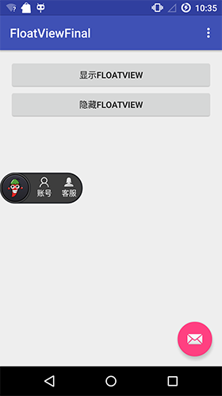

# FloatViewFinal简介
泡椒网游戏SDK Float View（悬浮窗）实现

* 无需任何权限
* 兼容MIUI系统

关于Android无需权限显示悬浮窗,请【[点击](http://www.jianshu.com/p/167fd5f47d5c)】

DEMO apk文件【[下载](https://raw.githubusercontent.com/pengjianbo/FloatViewFinal/master/FloatViewFinal-Sample.apk)】

##效果图

License
-------

    Licensed under the Apache License, Version 2.0 (the "License");
    you may not use this file except in compliance with the License.
    You may obtain a copy of the License at

       http://www.apache.org/licenses/LICENSE-2.0

    Unless required by applicable law or agreed to in writing, software
    distributed under the License is distributed on an "AS IS" BASIS,
    WITHOUT WARRANTIES OR CONDITIONS OF ANY KIND, either express or implied.
    See the License for the specific language governing permissions and
    limitations under the License.